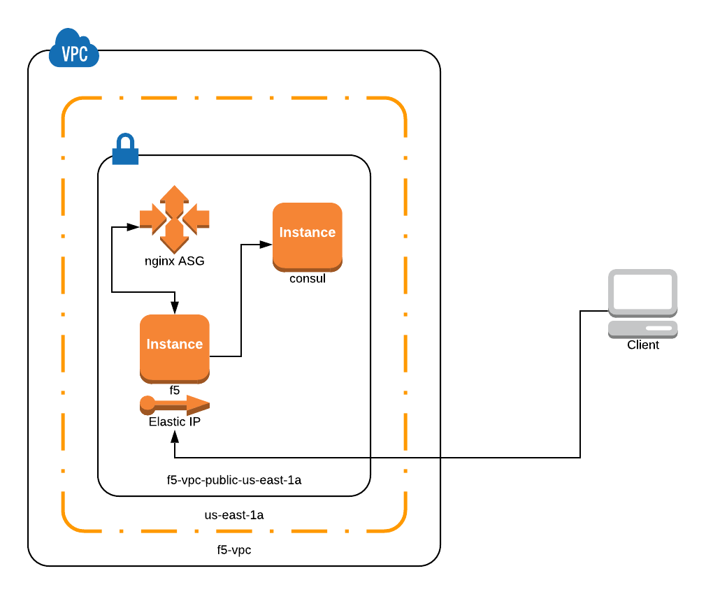

# F5 BIG-IP Terraform & Consul Webinar - Zero Touch App Delivery with F5, Terraform & Consul
- This repository will provision BIG-IP VE (Pay as you Grow), Consul & NGINX servers in AWS

# Overview Video
- [Nov 2020](https://youtu.be/b7RFww6SfxM)

# Demo Video
You can check out a recording of this demo
- [May 2021](https://youtu.be/EMQBbESjyaY?t=1723)
- [Aug 2020](https://youtu.be/cBJ9NyPhE9o?t=1151) 
- [Oct 2019](https://youtu.be/rVTgTXpiopc?t=1489)

# Architecture


# How to use this repo

- Option 1 - Setting up a complete new Application on your F5 BIG-IP through AS3 leveraging Consul integration: Follow the steps outlined below.
- Option 2 - Migrating an existing F5 BIG-IP deployment to leverage AS3 Consul integration: Follow the steps outlined in [`README.md`](brownfield-approach/README.md) within `brownfield-approach` subfolder.
- Option 3 - Using Network Infrastructure Automation (NIA) to "push" updates.  Follow the steps outlined in [`README.md`](nia/README.md) within `nia` subfolder.

# Lab Guide

There is a Lab Guide that is designed to work within F5's Unified Demo Framework.  The lab walks through options 1 and 3.

You can generate the HTML version of the guide by running the following commands.

```
cd docs
pip install -r requirements.txt
make html
```

The generated docs will be in the `docs/_build/html` directory.

## Provision Infrastructure

The `terraform` directory has tf files for creating instances for consul, f5, iam policy, nginx servers with autoscale group.

- `main.tf` refers to what region is used on aws.
- `ssh.tf` is used to create the key pairs.
- `vpc.tf` is used to create a new vpc and also to define the aws security groups.
- `outputs.tf` is used to output and display F5 BIG-IP management IP and F5 BIG-IP dynamic Password

## Requirements

This demo has been developed on Ubuntu 18.04 and Mac OS.  

- terraform 1.0.7
- aws cli (including credentials to an AWS account)
- openssl
- Python passlib (for Mac OS users)

## Steps 
- Clone the repository & change working directory to terraform
```
git clone https://github.com/hashicorp/f5-terraform-consul-sd-webinar
cd f5-terraform-consul-sd-webinar/terraform/
```

**For Mac Users**

```
$ python3 -m venv venv
$ source venv/bin/activate
$ pip install -r requirements.txt
```

- Create Terraform run
- Modify `terraform.tfvars.example` and add a prefix to identify your resources
- Modify `terraform.tfvars.example` specify the source IP address you will be connecting from i.e. 192.0.2.10/32 
- Rename `terraform.tfvars.example` to `terraform.tfvars`

```
terraform init
terraform plan
terraform apply
```

The following steps will occur:

  - Create BIG-IP (using [`terraform-aws-bigip-module`](https://github.com/f5devcentral/terraform-aws-bigip-module)), consul, NGINX web server instances on AWS
  - Seed a `terraform.tfvars` file in the `as3` directory for use in the next step
  - Install the AS3 RPM using [`f5-bigip-runtime-init`](https://github.com/F5Networks/f5-bigip-runtime-init)

It may take up to 5 minutes or after the run is complete for the environment to become ready. The URL for the BIG-IP UI is provided as part of the output.  Verify you can reach the UI before proceeding.


## Configure BIG-IP


Next we need to deploy the AS3 declaration using the bigip terraform provider.

```
terraform init
terraform plan
terraform apply
```

- Do terraform plan & apply, this will deploy the AS3 declarative JSON for service discovery on BIG-IP. It will use [`main.tf`](as3/main.tf) file. You can review the `terraform.tfvars` file that was generated in the previous step or rename and edit `terraform.tfvars.example` file in that directory to pass the necessary variables to terraform, or enter them manually via the CLI, copying the format of the values in the file.
- Now you have Virtual IP and Pool information already configured on BIG-IP in partition defined in the consul.json file.

# How to test?
- You can access backend applications using http://VIP_IP:8080 where VIP_IP is the Elastic IP which maps to BIG-IP Private VIP_IP.
- The NGINX servers are already in Auto scale group with consul agents running and sending all information to Consul server.
- Use case is when you destroy or bring down  one of the NGINX server, BIG-IP AS3 will poll the consul server and update the pool members automatically
- So as the NGINX web servers are going up and down the BIG-IP Pool members are updated automatically without manual intervention.  
- Use http://consul_public_IP:8500 to access the consul server and check the status of consul nodes count

### Folder as3
Folder as3 has three files, `main.tf`, `nginx.json` and `variables.tf`. `main.tf` is used to provision `nginx.json` template to BIG-IP once its ready.


### Folder scripts
`consul.sh` is used to install consul
`f5.tpl` is used to change the admin password.
`nginx.sh` is used to install consul agent on nginx servers


### Product Versions
- Terraform 1.0.7
- Consul 1.10.2
- BIG-IP image used is 16.1.0 version
- AS3 rpm used is [3.30.0 version](https://github.com/F5Networks/f5-appsvcs-extension/releases/download/v3.30.0/f5-appsvcs-3.30.0-5.noarch.rpm)
