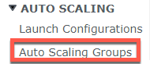
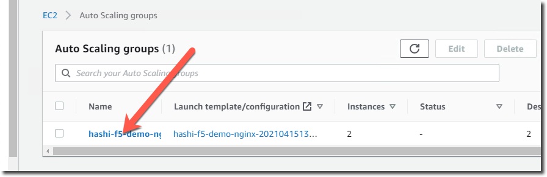
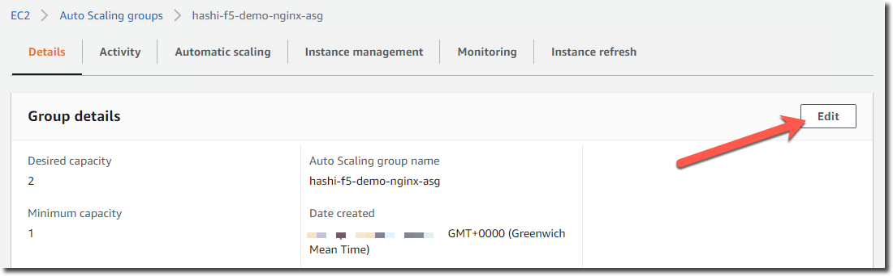

AWS Auto Scale
==============

In the AWS Console find the "EC2" service.

In the left menu find "Auto Scaling Groups"

Find the Auto Scaling Group and click on the name.

Click on "Edit"

.. warning:: It may take a few minutes for the new instances to be created

Modify the "Desired Capacity" from 2 to 3.  This will trigger AWS to add an additional NGINX web server.

On the BIG-IP you should see the new pool members get added.

.. image:: ./images/aws-auto-scaling-big-ip.png

On the NGINX page click on "Auto Refresh" you should see.

  .. image:: ./images/aws-auto-scaling-nginx-3.gif
