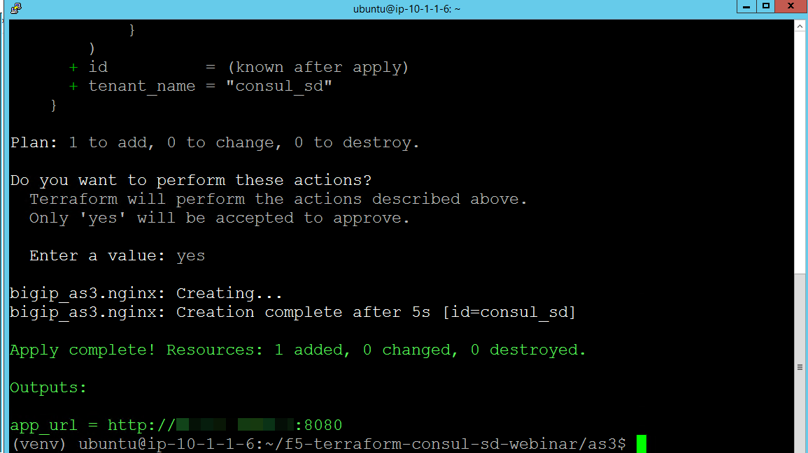

Terraform: Step #2
==================

After you complete Step #1 you should see URLs for Consul and BIG-IP.

.. image:: ./images/terraform-1-complete.png

.. warning:: It may take several minutes for the BIG-IP to become available.

Visit these URLS.

Consul
------

.. image:: ./images/terraform-2-consul.png

BIG-IP
------

.. image:: ./images/terraform-2-big-ip.png

You may have to wait a few minutes before you can login.	   

Deploy AS3 Declaration
----------------------

On the Ubuntu host run the following commands

.. code-block:: shell
  
  $ cd ~/f5-terraform-consul-sd-webinar/as3/
  $ terraform init
  $ terraform plan
  $ terraform apply

.. note::   
   If you see an error similar to

   .. code-block::
     
     Error: Error updating json  Consul_SD: HTTP 401 :: {"code":401,"message":"Authorization failed: no user authentication header or token detected. Uri:http://localhost:8100/mgmt/shared/appsvcs/task/fc42bcb0-c2a4-463e-b258-a2b480339fcb Referrer:192.0.2.10 Sender:192.0.2.10","referer":"192.0.2.10","restOperationId":2174351,"kind":":resterrorresponse"} 
 
   You can re-run the command it and should proceed normally.

In this scenario we are executing a shell script that will
deploy the "nginx.json" declaration that is configured to use Consul's API for
service discovery.

You should see the following output.

Follow the URL and you should see NGINX.

.. image:: ./images/terraform-2-nginx-1.png

At this point you should observe that on the BIG-IP there is partition named "Consul_SD".  Select the partition (top right of screen).

This partition was created by the "nginx.json" that contains the following.

.. code-block:: JavaScript
   
	{
	"class": "AS3",
	"action": "deploy",
	"persist": true,
	"declaration": {
		"class": "ADC",
		"schemaVersion": "3.24.0",
		"id": "Consul_SD",
		"Consul_SD": {
		"class": "Tenant",
		"Nginx": {
			"class": "Application",
			"template": "http",
			"serviceMain": {
			"class": "Service_HTTP",
			"virtualPort": 8080,
			"virtualAddresses": [
				"10.0.0.200"
			],
			"pool": "web_pool",
			"persistenceMethods": [],
			"profileMultiplex": {
				"bigip": "/Common/oneconnect"
			}
			},
			"web_pool": {
			"class": "Pool",
			"monitors": [
				"http"
			],
			"members": [
				{
				"servicePort": 80,
				"addressDiscovery": "consul",
				"updateInterval": 10,
				"uri": "http://10.0.0.100:8500/v1/health/service/nginx?passing",
			"jmesPathQuery": "[*].{id:Node.Address,ip:{private:Node.Address,public:Node.Address},port:Service.Port}"
				}
			]
			}
		}
		}
	}
	}

Once the partition is selected you should observe there is a pool named "web_pool" and there is a single pool member.  In the next step we will increase the number of NGINX nodes and you will see the change reflected on the BIG-IP.   

